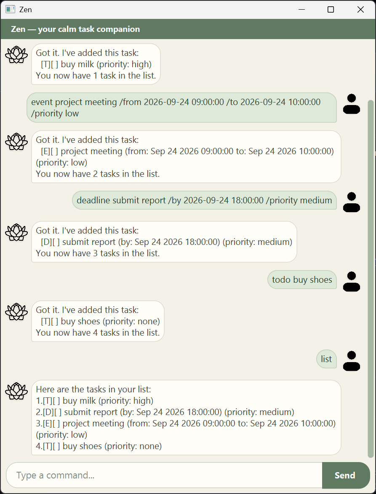

# Zen User Guide

Zen is a friendly desktop task manager for people who prefer typing commands. Add
todos, deadlines, and events; then use Zen to find, complete, and prioritize them.
Your tasks are saved automatically between sessions.

## Quick start

1. Make sure Java `25` or later is installed on your computer.  
**Mac users**: Ensure you have the precise JDK version prescribed [here](https://se-education.org/guides/tutorials/javaInstallationMac.html).
2. Download the latest `zen.jar` from [here](https://github.com/Unknownflow/ip/releases/tag/A-Release).
3. Copy the file to the folder you want to use as the home folder for your Zen chatbot.
4. Open a terminal in that folder and run `java -jar zen.jar`. A GUI similar to the one below should appear in a few seconds. Note how the Zen chatbot contains some sample data.

5. Type a command in the command box and press Enter to execute it.  
Some example commands you can try:

- `todo buy milk /priority high`: Adds a todo to buy milk with high priority.
- `deadline submit report /by 2026-08-24 18:00:00 /priority medium`: Adds a deadline to submit report with medium priority by 6pm on Aug 24, 2026.
- `event project meeting /from 2026-09-24 09:00:00 /to 2026-09-24 10:00:00 /priority low`: Adds an project meeting event with low priority from 9am to 10am on Sep 24, 2026.
- `list`: Lists all tasks.
- `bye`: Exits the app.

## Command format

- Text in `UPPER_CASE` is a value you provide. For example, replace `DESCRIPTION`
  in `todo DESCRIPTION` with `buy milk`.
- Text in `[square brackets]` is optional.
- Dates use `yyyy-MM-dd`; date-times use `yyyy-MM-dd HH:mm:ss`, for example
  `2026-08-24 18:00:00`.
- Command words and priority values are case-insensitive. Task descriptions are case-sensitive.
- Do not use `|` in a task description.

## Features

### Adding a todo: `todo`

Adds a task without a date or time.

Format: `todo DESCRIPTION [/priority PRIORITY]`

Example: `todo buy milk /priority high`

### Adding a deadline: `deadline`

Adds a deadline that is due at a particular date and time.

Format: `deadline DESCRIPTION /by yyyy-MM-dd HH:mm:ss [/priority PRIORITY]`

Example: `deadline submit report /by 2026-08-24 18:00:00 /priority medium`

### Adding an event: `event`

Adds an event that happens from one date-time to another.

Format: `event DESCRIPTION /from yyyy-MM-dd HH:mm:ss /to yyyy-MM-dd HH:mm:ss [/priority PRIORITY]`

Example: `event project meeting /from 2026-08-24 09:00:00 /to 2026-08-24 10:00:00 /priority low`

The end date-time may be the same as the start date-time, but cannot be earlier.

### Setting a priority

The optional `/priority` clause is available when adding any task. `PRIORITY` must
be `high`, `medium`, or `low`; omit the clause for `none`. Add it once, at the end
of the command. Zen lists tasks in this order: high, medium, low, then none.
Tasks with the same priority stay in the order in which you created them.

Priority cannot be changed after a task has been added. Delete the task and add it
again with the desired priority.

### Listing all tasks: `list`

Shows all tasks in priority order followed by insertion order.

Format: `list`

### Finding tasks: `find`

Shows tasks whose descriptions contain the keyword.

Format: `find KEYWORD`

The match is case-sensitive. For example, `find book` finds `read book` but not
`Book club`.

### Viewing tasks on a date: `occur`

Shows deadlines due on the given date and events that span it. Todos are not shown.

Format: `occur yyyy-MM-dd`

Example: `occur 2026-08-24`

### Completing, reopening, or deleting a task: `mark`, `unmark`, `delete`

Use the task number shown by `list`.

| Action | Format | Example |
| --- | --- | --- |
| Mark as done | `mark TASK_NUMBER` | `mark 2` |
| Mark as not done | `unmark TASK_NUMBER` | `unmark 2` |
| Delete | `delete TASK_NUMBER` | `delete 2` |

Task numbers always refer to the complete, priority-ordered task list. Run `list`
before using one of these commands; numbers in `find` and `occur` results are only
for viewing.

### Exiting Zen: `bye`

Closes Zen.

Format: `bye`

## Saving and storage

Zen saves automatically after you add, mark, unmark, or delete a task. Its data is
stored in `data/task_list.txt`, relative to the folder from which Zen is run. You do
not need to edit this file; if you do, make a backup first because malformed data
prevents Zen from loading the list.

## Command summary

| Action | Format |
| --- | --- |
| Add a todo | `todo DESCRIPTION [/priority PRIORITY]` |
| Add a deadline | `deadline DESCRIPTION /by yyyy-MM-dd HH:mm:ss [/priority PRIORITY]` |
| Add an event | `event DESCRIPTION /from yyyy-MM-dd HH:mm:ss /to yyyy-MM-dd HH:mm:ss [/priority PRIORITY]` |
| List tasks | `list` |
| Find tasks | `find KEYWORD` |
| View tasks on a date | `occur yyyy-MM-dd` |
| Mark task done | `mark TASK_NUMBER` |
| Reopen task | `unmark TASK_NUMBER` |
| Delete task | `delete TASK_NUMBER` |
| Exit | `bye` |
